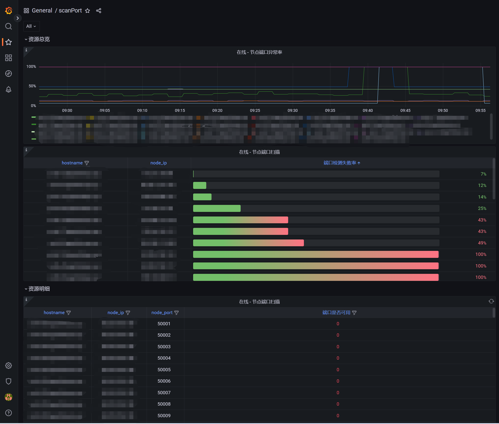

# scanPort-exporter

端口扫描连通性状态的 metrics API, 提供给 prometheus 的 exporter.

端口扫描 metrics 使用 golang 实现高性能高并发.

[Language English](README.md)

## 使用
安装使用方法
```shell
version=v1.2
mkdir /usr/local/scanPort-exporter
wget https://github.com/weiqiang333/scanPort-exporter/releases/download/${version}/scanPort-exporter-linux-amd64-${version}.tar.gz
tar -zxf scanPort-exporter-linux-amd64-${version}.tar.gz -C /usr/local/scanPort-exporter
chmod +x /usr/local/scanPort-exporter/scanPort-exporter
cd /usr/local/scanPort-exporter
/usr/local/scanPort-exporter/scanPort-exporter --config_file config/config.yaml
    # Don't forget to modify your config file /usr/local/scanPort-exporter/config/config.yaml
cp /usr/local/scanPort-exporter/config/scanPort-exporter.service /etc/systemd/system/
systemctl daemon-reload
systemctl enable --now scanPort-exporter
systemctl status scanPort-exporter
```
scanPort-exporter 支持的启动参数:
```
      --address string       Listen address (default ":9106")
      --config_file string   config file (default "config/config.yaml")
      --scan_source string   scan_source configfile/prometheus (default "prometheus")
```
- API URL
```shell
    http://127.0.0.1:9106/metrics
    http://127.0.0.1:9106/reload  # 从新加载配置文件 default "config/config.yaml"
```

## prometheus
- prometheus.conf
```yaml
- job_name: node_scan
  honor_timestamps: true
  scrape_interval: 2m
  scrape_timeout: 20s
  metrics_path: /metrics
  scheme: http
  follow_redirects: true
  enable_http2: true
  static_configs:
  - targets:
    - 127.0.0.1:9106
```
- http://127.0.0.1:9106/metrics
```
# HELP scanport_exporter_scan_port 端口连通性扫描, 0 关闭，1 开放
# TYPE scanport_exporter_scan_port gauge
scanport_exporter_scan_port{hostname="hostname",node_ip="127.0.0.1",node_port="50001"} 1
scanport_exporter_scan_port{hostname="hostname",node_ip="127.0.0.1",node_port="50002"} 1
scanport_exporter_scan_port{hostname="hostname",node_ip="127.0.0.1",node_port="50003"} 1
scanport_exporter_scan_port{hostname="hostname",node_ip="127.0.0.1",node_port="50004"} 1
scanport_exporter_scan_port{hostname="hostname",node_ip="127.0.0.1",node_port="50005"} 1
scanport_exporter_scan_port{hostname="hostname",node_ip="127.0.0.1",node_port="50006"} 1
scanport_exporter_scan_port{hostname="hostname",node_ip="127.0.0.1",node_port="50007"} 1
scanport_exporter_scan_port{hostname="hostname",node_ip="127.0.0.1",node_port="50008"} 1
scanport_exporter_scan_port{hostname="hostname",node_ip="127.0.0.1",node_port="50009"} 1
scanport_exporter_scan_port{hostname="hostname",node_ip="127.0.0.1",node_port="50010"} 1
scanport_exporter_scan_port{hostname="hostname",node_ip="127.0.0.1",node_port="50011"} 1
scanport_exporter_scan_port{hostname="hostname",node_ip="127.0.0.1",node_port="50012"} 1
scanport_exporter_scan_port{hostname="hostname",node_ip="127.0.0.1",node_port="50013"} 1
scanport_exporter_scan_port{hostname="hostname",node_ip="127.0.0.1",node_port="50014"} 1
scanport_exporter_scan_port{hostname="hostname",node_ip="127.0.0.1",node_port="50015"} 1
scanport_exporter_scan_port{hostname="hostname",node_ip="127.0.0.1",node_port="50016"} 1
scanport_exporter_scan_port{hostname="hostname",node_ip="127.0.0.1",node_port="50017"} 1
scanport_exporter_scan_port{hostname="hostname",node_ip="127.0.0.1",node_port="50018"} 1
scanport_exporter_scan_port{hostname="hostname",node_ip="127.0.0.1",node_port="50019"} 1
scanport_exporter_scan_port{hostname="hostname",node_ip="127.0.0.1",node_port="50020"} 1
scanport_exporter_scan_port{hostname="hostname",node_ip="127.0.0.1",node_port="50021"} 1
scanport_exporter_scan_port{hostname="hostname",node_ip="127.0.0.1",node_port="50022"} 1
scanport_exporter_scan_port{hostname="hostname",node_ip="127.0.0.1",node_port="50023"} 1
scanport_exporter_scan_port{hostname="hostname",node_ip="127.0.0.1",node_port="50024"} 1
scanport_exporter_scan_port{hostname="hostname",node_ip="127.0.0.1",node_port="50025"} 1
scanport_exporter_scan_port{hostname="hostname",node_ip="127.0.0.1",node_port="50026"} 1
scanport_exporter_scan_port{hostname="hostname",node_ip="127.0.0.1",node_port="50027"} 1
scanport_exporter_scan_port{hostname="hostname",node_ip="127.0.0.1",node_port="50028"} 1
scanport_exporter_scan_port{hostname="hostname",node_ip="127.0.0.1",node_port="50029"} 1
scanport_exporter_scan_port{hostname="hostname",node_ip="127.0.0.1",node_port="50030"} 1
scanport_exporter_scan_port{hostname="hostname",node_ip="127.0.0.1",node_port="12345"} 1
scanport_exporter_scan_port{hostname="hostname",node_ip="127.0.0.1",node_port="80"} 0
```


## grafana
这是 [仪表板模板](./docs/grafana.json), 可以导入 grafana 以获得基本的仪表板。

展示仪表板案例:

